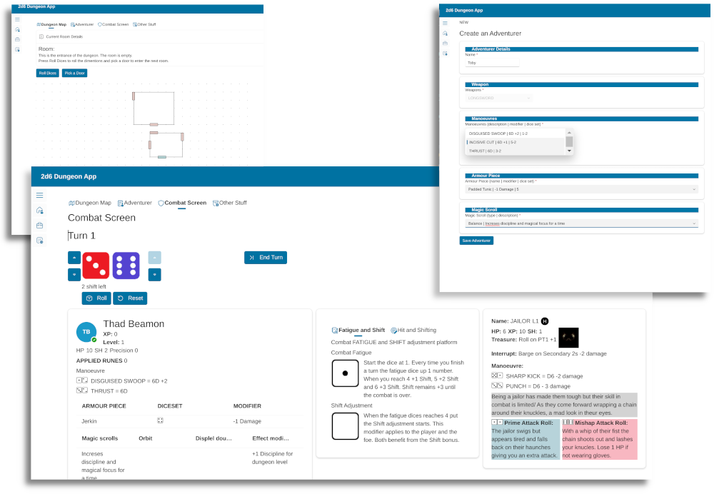
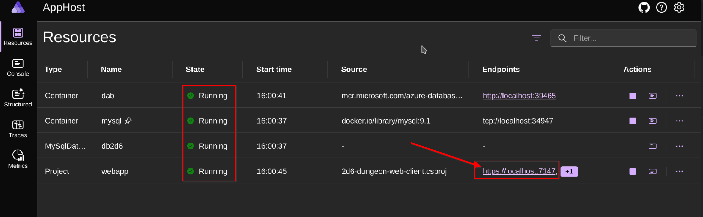

# 2d6 Dungeon App

[2D6 Dungeon](https://drgames.co.uk/2d6-dungeon-a-classic-dungeon-crawler-solo-player-game/) is a classic style dungeon crawler, print and play, roll and write game designed for solo play. You explore randomly generated dungeon rooms, fight monsters and collect treasure as you gain experience and strive to become a legendary adventurer. Every adventure and dungeon is unique. I was created by DR Games and it's a paper and dice game.

This project is a digital version of the game, with creator's approval. It's a web application that allows you to play the game on your computer or mobile device. It's a work in progress. I progress by iteration improuving the code, the struture at each passes.

📅 Details on the progress of the project can be found on the [project's board](https://github.com/users/FBoucher/projects/13).

### Features

- [X] Help with the construction of your adventurer.
- [X] Save and load adventurers.
- [X] Save and load adventures.
- [X] Help with the rules when creating a new room.
- [X] No need of physical dice.
- [X] digital map.
- [X] Help with battle rules  

### Related Content

While I prototype functionalities, and make progress I create content (blog post and videos) to document my journey. Here the list of the content:

- 📄 [Database to go! The perfect database for developer](https://www.frankysnotes.com/2023/11/database-to-go-perfect-database-for.html)
- 📺 [The perfect database for developers](https://www.youtube.com/watch?v=Y114CBEnPEU)
- 🤳 [Developer Database To Go](https://www.youtube.com/watch?v=1zXFNXxZAZE)
- 📺 [How to Quickly Generate APIs for your Database](https://www.youtube.com/watch?v=-d5PJqEdtyU)
- 📺 [How to Create a DEV Environment with Multiple Dev Containers](https://www.youtube.com/watch?v=sf3Ai4271nA)
 

### How to Run it Locally

The solution uses .NET Aspire to manage all the services and website. 

- You will need Docker [Docker](https://docs.docker.com/desktop/) or [Podman](https://podman.io/), and [.NET 9](https://dotnet.microsoft.com/en-us/download) installed.
- Clone the repository locally.
- To start 2d6-dungeon-client, from Open the solution in VSCode or Visual Studio and press F5. If asked for the starting point of the solution select the orchestrator `AppHost`. Once the solution starts it will:
  - Open the .NET Aspire Dashboard in a web browser.
  - Create a MySQL container, create the database using the SQL script included.
  - Create a data API, in a second container.
  - Start the 2D6 Dungeon webApp.

Once everything is ✅ Running, click on the Endpoint of the webApp

### Contributing

**2d6-dungeon-app** is built for the community, by the community - and maintained by Frank Boucher. Your contributions are welcome! There a [diagram](medias/2d6-Dungeon-app_v0-1.png) of the classes services and database tables to help visualizing the structure. Note that it's always evolving.

Take a look at [CONTRIBUTING](/CONTRIBUTING.md) for details.

Join the [Discord](https://discord.gg/6zA3jKw) community to discuss the project, ask questions, and share your ideas.